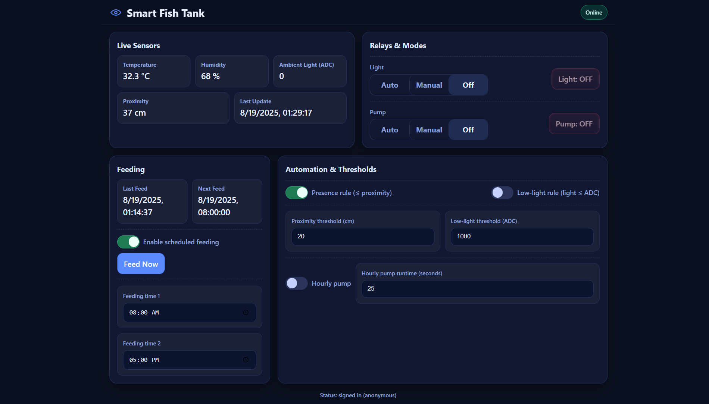

# Smart Fish Tank (ESP32 + Firebase + Web UI)

A connected fish-tank controller built on **ESP32**, syncing with **Firebase Realtime Database** and a lightweight responsive **web dashboard**.
It automates lighting and pump, schedules feeding via servo, and shows live sensor data (temperature, humidity, ambient light, proximity).
The **buzzer only beeps during feeding**—no other alarms.

<p align="center">
  
</p>

> 🟢 **Mobile-friendly UI**: Buttons highlight when ON, segmented controls for modes, and large touch targets.

---

## ✨ Features

* **Sensors**: DHT11 (temp/humidity), LDR (ambient light via ADC), Ultrasonic (presence/proximity)
* **Actuators**: Light relay, Pump relay (active-LOW), Servo feeder, Buzzer (beeps **only** on feed), OLED (SSD1306)
* **Automation**

  * *Light mode*: Auto / Manual / Off
    Auto turns light ON when presence is detected **or** light is below threshold
  * *Pump mode*: Auto / Manual / Off
    Auto runs on presence + optional hourly boost (configurable seconds each hour)
  * *Scheduled feeding*: Two daily HH\:MM times; “Feed Now” button
* **Realtime sync** to Firebase RTDB: `/sensors`, `/states`, `/settings`, `/commands`, `/meta`, `/logs/sensors`
* **Web dashboard**: Plain HTML/JS, responsive, uses Firebase 9 (compat)
* **Offline-safe**: Device automations continue if Wi-Fi drops; UI queues changes when offline

---

## 🗂 Repository Structure

```
smart-fishtank/
├─ firmware/
│  └─ SmartFishTank.ino           # ESP32 firmware (Arduino IDE)
├─ web/
│  └─ index.html                  # Responsive dashboard
├─ docs/
│  ├─ screenshot-dashboard.png    # <— replace with your screenshot
│  ├─ screenshot-mobile.png       # <— replace with your mobile screenshot
│  └─ esp32-wiring.png            # <— wiring diagram image (optional)
└─ README.md
```

> Replace the `docs/*.png` placeholders with your images so they render on GitHub.

---

## 🔧 Hardware

* **ESP32** (e.g., DevKit-V1)
* **DHT11** temperature/humidity sensor (GPIO 15)
* **Ultrasonic sensor** (e.g., HC-SR04) (TRIG 27, ECHO 18)

  > ⚠️ If your sensor is 5V, **level-shift ECHO** to 3.3V (or use a resistor divider).
* **LDR/photoresistor** to **ADC** (GPIO 32) with a resistor divider
* **Relay modules** (active-LOW): Light (GPIO 5), Pump (GPIO 16)
* **Buzzer** (GPIO 25)
* **Servo** for feeder (GPIO 4)
* **OLED SSD1306** I²C (SDA 21, SCL 22)

> ⚠️ **Powering the Servo:** Use a stable 5V supply for the servo; **common GND** with ESP32.

---

## 🧰 Arduino Setup

1. **Board Manager**

   * Install **ESP32 by Espressif Systems** (e.g., 3.x)
2. **Libraries (Library Manager)**

   * **Firebase Arduino Client Library for ESP8266 and ESP32** (by Mobizt)
   * **DHT sensor library** (Adafruit) + **Adafruit Unified Sensor**
   * **Adafruit GFX Library**
   * **Adafruit SSD1306**
   * **ESP32Servo**
3. Open `firmware/SmartFishTank.ino`, set your:

   ```cpp
   #define WIFI_SSID     "your-ssid"
   #define WIFI_PASSWORD "your-pass"
   #define API_KEY       "your-firebase-web-api-key"
   #define DATABASE_URL  "https://<your-project-id>-default-rtdb.<region>.firebasedatabase.app"
   ```
4. Select the correct **Port** and **Board**, then **Upload**.

---

## ☁️ Firebase Setup

1. Create a Firebase project
2. **Realtime Database** → create DB (choose a region)
3. **Authentication** → **Sign-in method** → enable **Anonymous**
4. **Project Settings** → **General** → copy web config into `web/index.html`
5. **Database Rules (dev-friendly):**

   ```json
   {
     "rules": {
       ".read": "auth != null",
       ".write": "auth != null"
     }
   }
   ```

   > For production, tighten rules to your needs.

---

## 🗄 Realtime Database Schema

The firmware & UI expect these paths:

```
/sensors
  temperature_c: number
  humidity_pct: number
  light_adc: number
  proximity_cm: number
  last_update: unix_sec

/states
  light_on: boolean
  pump_on: boolean
  light_mode: "auto" | "manual" | "off"
  pump_mode:  "auto" | "manual" | "off"

/settings
  presence_rule: boolean
  low_light_rule: boolean
  hourly_pump:
    enabled: boolean
    seconds: number
  thresholds:
    proximity_cm: number
    low_light_adc: number
  feeding:
    enabled: boolean
    time1: "HH:MM"
    time2: "HH:MM"

/commands
  light_mode: "auto" | "manual" | "off"
  pump_mode:  "auto" | "manual" | "off"
  light_manual_state: boolean
  pump_manual_state: boolean
  feed_now: boolean

/meta
  last_feed_time: unix_sec
  last_feed_label: "feed1" | "feed2" | "manual"

/logs
  /sensors/<YYYY-MM-DD>/<unix_sec>
    tC, h, ldr, prox_cm
```

### Suggested initial `/settings`

```json
{
  "presence_rule": true,
  "low_light_rule": true,
  "hourly_pump": { "enabled": true, "seconds": 25 },
  "thresholds": {
    "proximity_cm": 20,
    "low_light_adc": 1700
  },
  "feeding": {
    "enabled": true,
    "time1": "08:00",
    "time2": "20:00"
  }
}
```

---

## 🌐 Web Dashboard

* Static page at `web/index.html`
* Uses Firebase v9 (compat) + Anonymous Auth
* **Deploy options:**

  * **Firebase Hosting**:

    ```bash
    npm i -g firebase-tools
    firebase login
    firebase init hosting   # select project, set public dir to web
    firebase deploy
    ```
  * **GitHub Pages**: serve `/web/index.html` from your `gh-pages` branch (or root for project site)

**UI Highlights**

* ON buttons glow green; OFF buttons soft red
* Segmented controls for modes (Auto/Manual/Off)
* Debounced settings write to `/settings`
* Offline banner; changes sync when back online

---

## 🧠 How Automation Works

* **Presence (ultrasonic)**: If distance ≤ `thresholds/proximity_cm`, presence is **true**
* **Low light (LDR)**: If ADC ≤ `thresholds/low_light_adc`, low-light is **true**
* **Light (AUTO)**: ON if `(presence_rule && presence) || (low_light_rule && lowLight)`
* **Pump (AUTO)**: ON if `(presence_rule && presence)`
  Plus: optional **hourly pump** boost runs `hourly_pump.seconds` each hour
* **Feeding**:

  * Runs at `feeding.time1` and `feeding.time2` (and via “Feed Now”)
  * **Buzzer**: *Only beeps briefly during feeding* (no water/temp alarms)
* **States**: Device pushes `/states` for UI to reflect

---

## 🔌 Pin Map (ESP32)

| Function             | Pin     |
| -------------------- | ------- |
| DHT11                | 15      |
| Ultrasonic TRIG      | 27      |
| Ultrasonic ECHO      | 18      |
| LDR (ADC)            | 32      |
| Light Relay (LOW=ON) | 5       |
| Pump Relay (LOW=ON)  | 16      |
| Buzzer               | 25      |
| Servo                | 4       |
| OLED SDA / SCL       | 21 / 22 |

> Adjust pins in firmware if your board differs.

---

## 🧪 Troubleshooting

* **Firebase compile errors**
  Make sure you installed **Firebase Arduino Client Library for ESP8266 and ESP32** by *Mobizt*. Use the functions exactly as in the provided firmware (e.g., `Firebase.RTDB.updateNode(&fbdo, path, &json);` with a **pointer**).
* **OLED not showing text**
  Confirm I²C address `0x3C` and wiring (SDA 21 / SCL 22).
* **Servo twitching / resets**
  Provide a **separate 5V** supply for the servo (GND common with ESP32).
* **Ultrasonic false reads**
  Add a small moving average or check echo level shifting to 3.3V.

---

## 🔒 Security Notes

* API keys in Firebase web apps are okay (they’re **not** secrets) but you **must** protect the DB with rules.
* Use `auth != null` and keep **Anonymous Auth** enabled.
* For production, consider scoping paths to a specific device UID.

---

## 📸 Screenshots

Place your images in `/docs/` so GitHub renders them:

* `docs/screenshot-dashboard.png` – desktop UI
* `docs/screenshot-mobile.png` – mobile UI
* `docs/esp32-wiring.png` – wiring diagram (optional)

Example embeds already included at the top of this README:

```md

```

> Tip: On macOS use `⌘⇧4`, on Windows `Win+Shift+S`, on Linux `gnome-screenshot` or `flameshot`.

---

## 📝 License

This project is released by Azees Asardeen under the **MIT License**. See `LICENSE` file (@2025.08.19).

---

## 🙌 Credits

* Firebase Arduino Client Library – **Mobizt**
* DHT / Unified Sensor / SSD1306 / GFX – **Adafruit**
* **ESP32Servo** library
* Icons and UX inspired by modern design systems
